## Cuda pathtracer
##### Hugo Peters (5927727)
##### December 2020

This the small report accompanying the 1st delivery for the Advanced Graphics course 2020-2021. For this project I have not worked with a partner.

## Dependencies

- nvidia-cuda-toolkit (apt) (tested on cuda 10 on sm_50 on a 960M, might have compatability issues on other platforms as I haven't tested these.)
- cmake >3.16
- OpenMP
- GLFW3 (source included as build dependency, no action required)

## How to build

Inside the directory of the project you need to initialize the cmake cache the first time you build.  `cmake .`

Then you can build with `cmake --build .` which creates the `pathtracer` executable.

## Quick description of the controls

- WASD        - Move the camera
- Arrow Keys  - Change the direction of the camera
- QE          - Move the light source up and down
- UI          - Grow and shrink the area light with index 0
- N           - Toggle Next Event Estimation
- C           - Toggle Path Guiding
- Space       - Toggle Raytracer /  Pathtracer
- Page UP     - Widen aperture
- Page DOWN   - Close the aperture
- Left Mouse Click - Set the focal distance to the object you click on (aka focus on that object)

- Num Keys     - select an object to attach to. 0 is the camera (and the default). Object ids are given in the order of adding them to the scene.


To select a scene pass a value to the `--scene` command line option. The following scenes are available:

- outside (default)
- sibenik 
- minecraft
- 2mtris
- example_scene.chai / `<path/to/script.chai>`

## new in version 3

- Move objects around by attach to them (see controls)
- Bokeh by sampling the lens (offsetting the orgin and then refocussing on the focal plane)
- Using blue noise in the first 100 samples before continuing fully randomized. Especially effective on materials with high albedo like
the floor in the sibenik (see image blow)
- Further improved performance by reducing stack traffic and branching, as well as using templating, in the traversal algorithm.
- Actually correct results. Previous version had a temporal correlation in the seed.
- A CDF over the skydome has been implemented but disabled for performance reasons. Furthermore is was beaten by the pathguiding implementation.
- An attempt to sort the rays in eight buckets based the octant of their direction vector but this did not yield a netto performance increase. Quite a significant slowdown in fact.
- Pathguiding using a 16 bucket hemisphere CDF that updates its weights by running an average with the incoming radiance each frame.

### Pathguiding implementation

During the shading stage, up to three bounces of sampled cache buckets are saved along with the mask at that point. There are no more
than 3 because of memory limitations on my low end card. Ideally there are 32 (MAX_RAY_DEPTH). Each saved cache then uses the total
radiance that is about to be added to framebuffer and divides by the mask to get the original energy vector at that location. The energy
is then converted to a single float (using max component) and atomically added to a seperate radiance cache buffer like so:

```cpp
__global__ void kernel_update_buckets(SceneBuffers buffers, TraceStateSOA traceState, const SampleCache* sampleCache)
{
    // id of the pixel
    const unsigned int i = blockIdx.x * blockDim.x + threadIdx.x;
    if (i >= NR_PIXELS) return;
    const float3 totalEnergy = get3f(traceState.accucolors[i]);

    for(uint bounce=0; bounce<MAX_CACHE_DEPTH; bounce++)
    {
        const SampleCache cache = sampleCache[i + (NR_PIXELS * bounce)];
        RadianceCache& radianceCache = buffers.radianceCaches[cache.triangle_id];

        if (cache.sample_type == SAMPLE_TERMINATE) return;
        if (cache.sample_type == SAMPLE_IGNORE) continue;
        const float energy = fminf(100.0f, fmaxcompf(totalEnergy / cache.cum_mask));
        atomicAdd(&radianceCache.additionCache[cache.cache_bucket_id], energy);
        atomicAdd(&radianceCache.additionCacheCount[cache.cache_bucket_id], 1.0f);
    }

}
```

Now that the `additionCache` and `additionCacheCount` have been populated we can calculate the average of the incoming radiance
of this frame to then add it to the actual buckets using running average. We do this in a per triangle basis as to avoid any
need for concurrency control:

```cpp
__global__ void kernel_propagate_buckets(SceneBuffers buffers)
{
    const unsigned int i = blockIdx.x * blockDim.x + threadIdx.x;
    if (i >= buffers.num_triangles) return;
    RadianceCache rc = buffers.radianceCaches[i];
    const float alpha = 0.95f;
#pragma unroll
    for(uint t=0; t<16; t++)
    {
        float additionCount = rc.additionCacheCount[t];
        if (additionCount < EPS) continue;
        const float oldValue = rc.radianceCache[t];
        const float incomingEnergy = rc.additionCache[t] / additionCount;
        const float newValue = clamp(alpha * oldValue + (1-alpha) * incomingEnergy, 0.1f, 2.0f);
        const float deltaValue = newValue - oldValue;
        rc.radianceCache[t] += deltaValue;
        rc.radianceTotal += deltaValue;
        rc.additionCache[t] = 0;
        rc.additionCacheCount[t] = 0;

    }
    buffers.radianceCaches[i] = rc;
}
```


### A demo for the path guiding.


On the left you see the baseline result with just normal cosine weighted hemisphere sampling.

On the right you see the result of sampling 1 of 16 buckets in the pathguiding CDF that has been
trained beforehand for <5 seconds.

Now another static example in a low light situation. Here both cases are the result of exactly 5 seconds
computation time. Note that the pathguided result on the right performs especially well on somewhat direct light
paths.

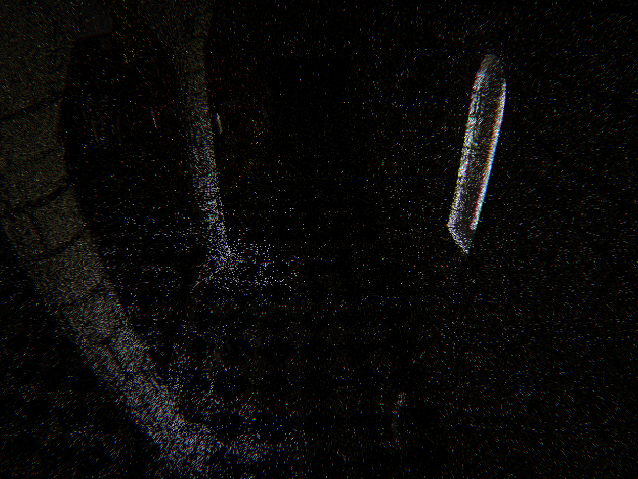
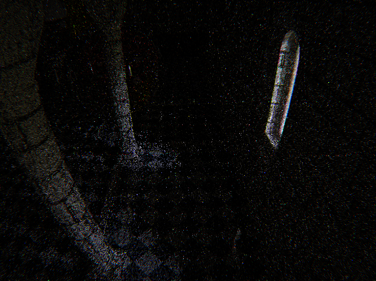

For clarity, here is a cropped version of the images.

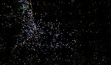
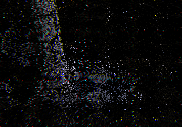

The effect is especially noticible in a open area with a bright spot in an HDR skydome. Note that the skydome
is considered indirect light so Next Event Estimation does not apply here. The images below are both 1spp

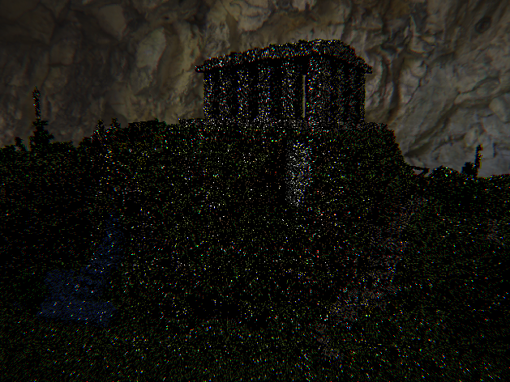
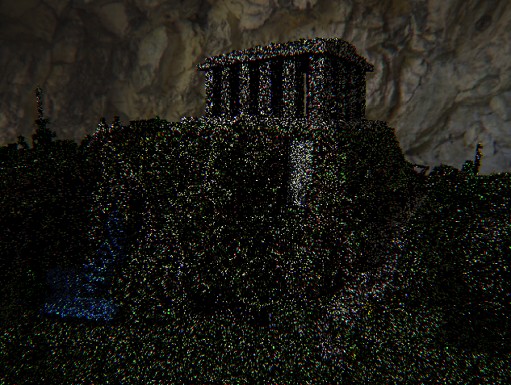

### A demo for blue noise.

The following blue noise texture is used:

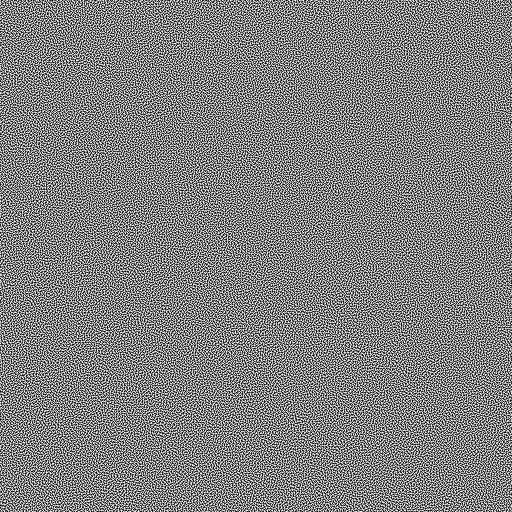

------------------------------

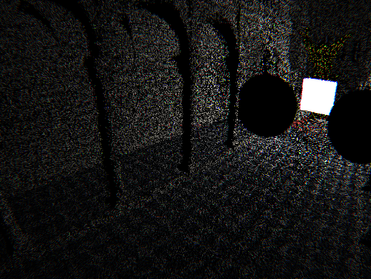
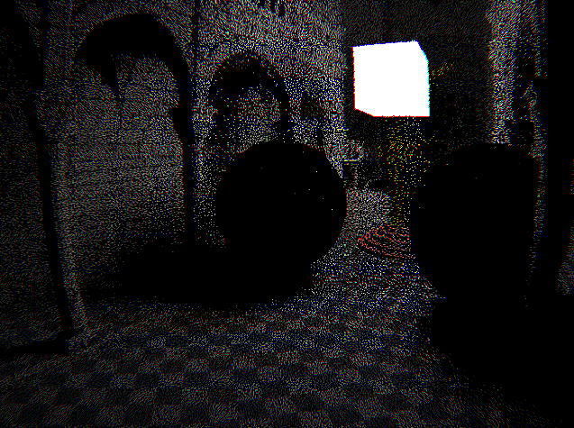

Both images are 1spp (with NEE obviously) although the left uses a wang hash initially and then xor shifts
while the right image samples random region of the blue noise texture. You can especially see the difference
on the high contrast marmer floor.

## new in version 2

** VIDEOS IN SCREENSHOT DIRECTORY **

- Skydome is now hdr
- BVH with binning approach (<700ms for 2M triangles single core)
- SIMD instructions here and there
- No more round trips to the GPU during rendering
- Render performance x3 (130 fps 1 diffuse, 1 shadow ray in sibenik)
- Toplevel BVH with full transformation support
- Russian Roulette (now 30+ fps with 1spp in sibenik)


---------------------------------------------------------
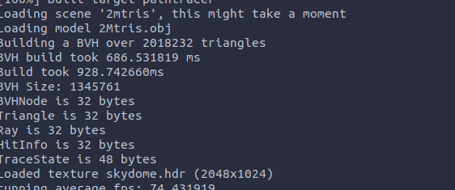
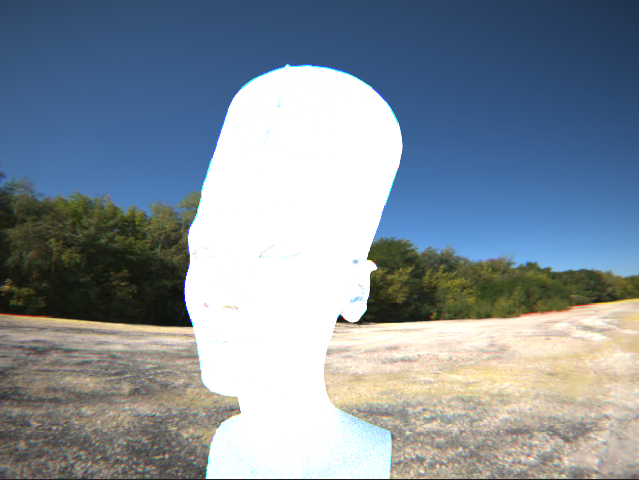

Building a BVH over 2M triangles under 1 second

-----------------------------------------------------------------

For a demo of the toplevel bvh please check out the video's in the screenshot directory.
Here  is an impression of the code structure:

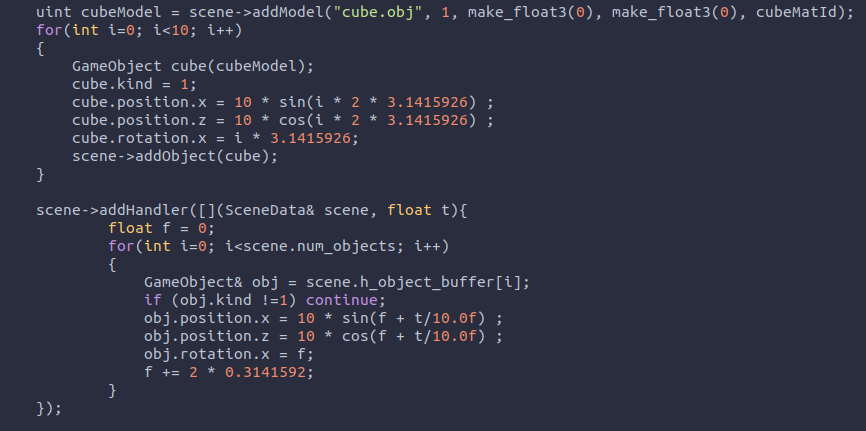

------------------------------

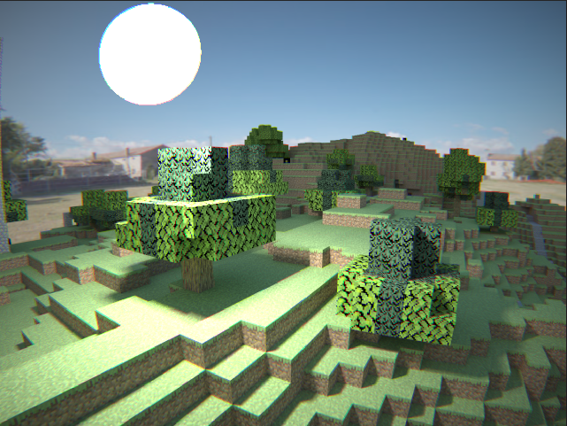

Textures with alpha channels are a WIP

-------------------------------

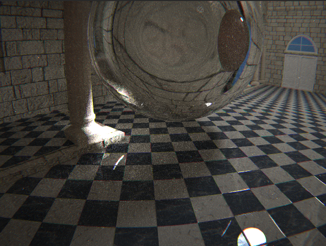
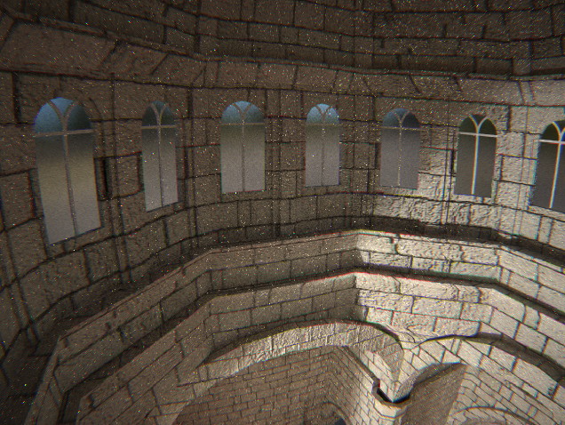

The sibenik cathedral in it's full glory with textures and normal maps.


## Quicklist of the features

- Interactive raytracer using OpenMP
- Realtime pathtracer using cuda
- Multiple scenes
- Glass, dielectrics and absorption
- obj loader and BVH builder using the SAH heuristic
- Efficient BVH traversal on the GPU.
- Multiple configurable point lights for the raytracer
- Multiple configurable area lights for the pathtracer
- Anti Aliasing for the pathtracer (for raytracer I valued interactivity more)
- Next Event Estimation for diffuse surfaces
- Skydome
- Post processing shader with gamma correction, chromatic aberration, and vignetting
- Barrel distortion at the primary ray level [^ref4]


## Implementation of the raytracer

The raytracer was implemented after the pathtracer. Although the pathtracer was implemented in cuda, 
I decided to implement the raytracer on the cpu. That way I could use recursion arbitrarily since 
it would have been very difficult to unroll the non tail recursive raytracer algorithm to run on 
graphics hardware efficiently. OpenMP was used as a simple and effective way to  parallelize the raytracer
dynamically on 8 threads. Given that the algorithm is embarrassingly parallel that resulted in a significant
speedup allowing a semi interactive experience.

Unlike the recursive parts of the whitted style radiance function, almost all intersection- and BVH traversal code
from the cuda implementation could reasonably easy be adjusted to compile both a device and host function.
For these function many external sources where used in order to focus more on the radiance algorithm than the math.
So is the triangle intersection code adopted from scratchapixel[^ref1]

## Implementation of the pathtracer

The pathtracer was implemented with a bit more thought regarding performance. First of all and most obvious is
that fact that it runs on the GPU using Cuda 10. Moreover, I process the rays in a wavefront manner as described
by Jacco on his blog (which intern is based on a paper by NVIDIA[^ref2]). The main benefit is especially felt
in scenes where a significant number of paths end prematurely. I expect that this choice of architecture will
be even more beneficial when Russian Roulette is implemented in the future.

Making the trace algorithm iterative was done by leaning on the concept of a mask and accumulator color 
to substitute the recursion state as inspired by this blogpost by Sam Lepere[^ref3]. However, I found that I needed a
few more properties in the state of a pixel. The complete type looks like this:

```cpp
struct __align__(16) TraceState
{
    float3 mask;
    float3 accucolor;
    float3 currentNormal;
    // contains the inverse of the last applied lambert multiplication.
    float correction;
    bool fromSpecular;
};
```

The reason for this extra state requirement is due to my interpretation of wavefront pathtracing where the 'extend' kernel,
which processes the shadowrays, needs to know the surface normal, and how to undo the already applied lambert term. Furthermore,
because of Next Event Estimation is it necessary to know whether the previous bounce was a specular interaction, which is an
indication that all we can do is fall back to just one standard ray. In the future MIS might play a role here but more research
is needed.

### Screenshots

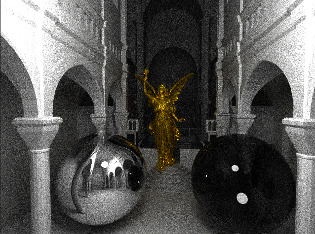
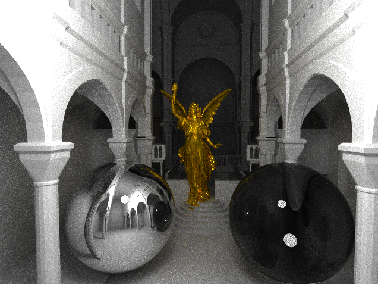

Comparision of Next Even Estimation off or on (left to right), both images are taken after about 60 seconds rendering on the sibenik scene. 
But since the version without NEE runs about 1.5 faster (because of the lack of shadowrays) the image on the left actually has about 
1.5 times more samples.

---

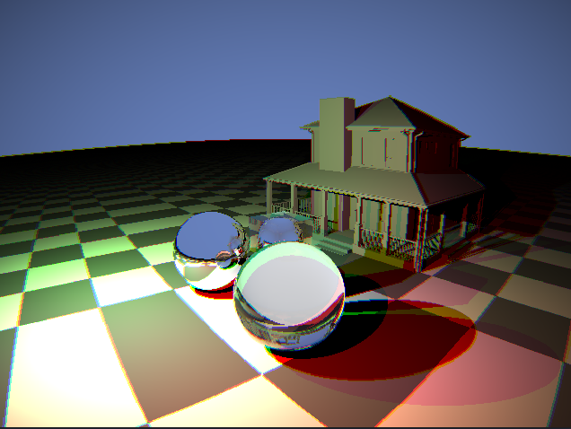
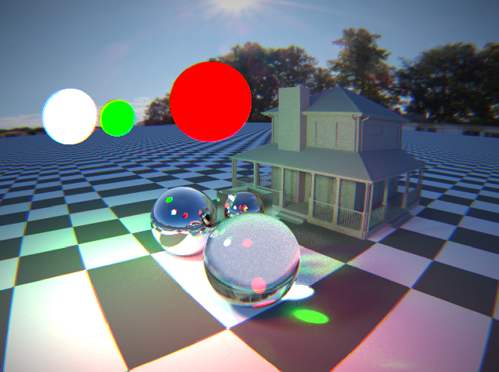

Comparasion of raytracing (left) vs pathtracer (right). Note that the skybox is currently only supported in pathtraced mode. 
But a constant colored skydome was selected for the raytracer to emulate similar lighting conditions.

---

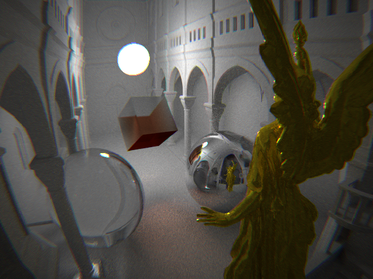

Finally that sibenik scene again with all post processing effects enabled. As well as a tilted glass cube with absorption for style.
Cheers Beer!

### Wishlist for the future

- Barrel distortion
- MIS 
- Spotlights
- Faster, Faster
- Loading screen
- Depth of field

### Closing remarks

The result is already much better than I had hoped for. It has cost many hours of labour but it was so much fun that I had no
problem pouring my soul into this project. I am also very excited to see what the rest of the course brings and how I can incorporate
more neat little tricks to make this project even better.

### References

[^ref1]: [Triangle intersection](https://www.scratchapixel.com/lessons/3d-basic-rendering/ray-tracing-rendering-a-triangle/moller-trumbore-ray-triangle-intersection)
[^ref2]: [Wavefront pathtracing](https://research.nvidia.com/sites/default/files/pubs/2013-07_Megakernels-Considered-Harmful/laine2013hpg_paper.pdf)
[^ref3]: [Iterative tracing](http://raytracey.blogspot.com/2015/12/gpu-path-tracing-tutorial-2-interactive.html)
[^ref4]: [Barrel distortion](https://www.imatest.com/docs/distortion_instructions/)
[^ref5]: [Optix Slab Test](http://jcgt.org/published/0007/03/04/)

